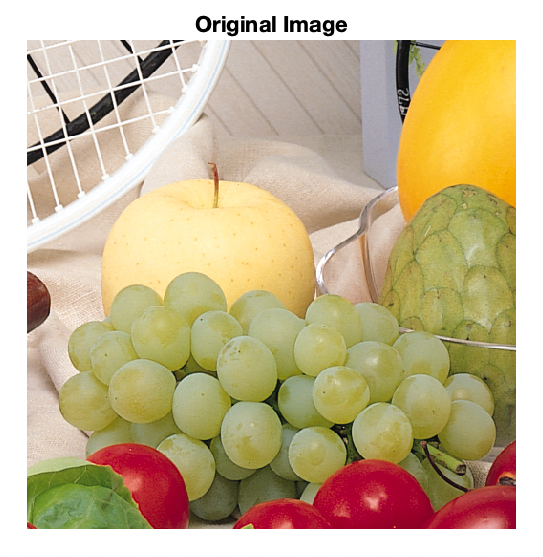
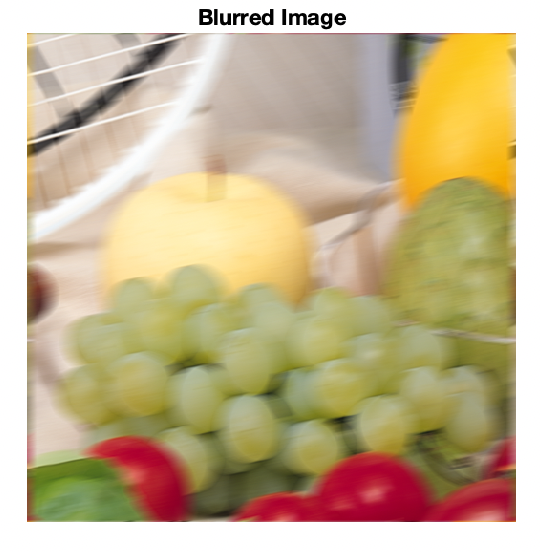
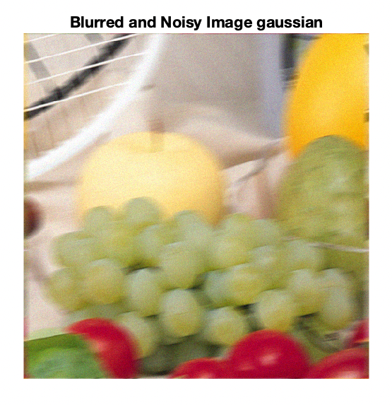
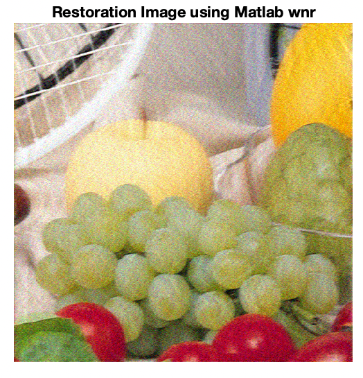
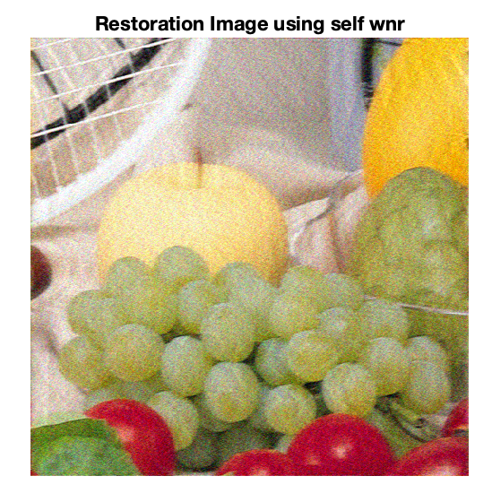

# Image Deblur Based on Wiener Filter

### ELEN4810-DSP-FinalProject-ImageDeblur

Final project for ELEN4810 Digital Signal Processing course.

## Project Description and Examples

### MotionBlurred Noisy Image Deblur

#### Motion Blur

#### Guassian Noise

#### Matalb Restoration

#### Self Restoration

## Installation

## Directory Organization

## Report

## References

## License
